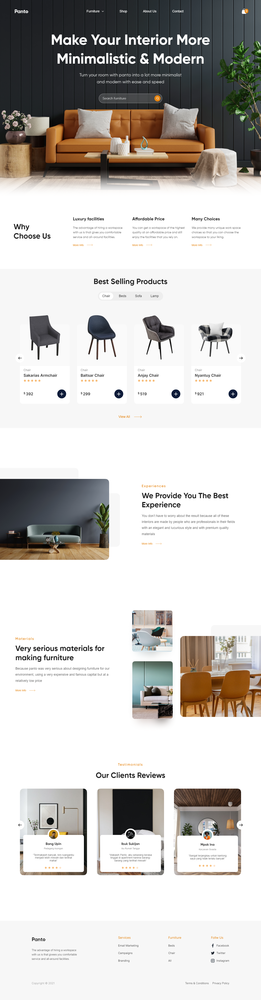

# Furniture Desgin Application

## Link

http://connor-kfitz.github.io/furniture-design-application

## Description

The goal of this project was to create a responsive furniture design page, based off of the following Figma page:

https://www.figma.com/community/file/1061732519182077733

## Outcomes

This project was succsessful in terms of mimicking the UI/UX design, and implementing responsivness.  I elected to use React for the sake of gaining experience using the framework, and implementation of components such as list items.

There are many areas I feel could have created better, and will be strongly considered for future development.  The carousel responsives works, but I believe I could make it much better by using JS.  This would also allow me to implement button / animation functionallity, as there is currently none.

My SCSS / CSS component delegation has improved greatly, but there is still a lot of room for work.  My use of semantic HTML elements has also imrpoved to a good state, but is by no means great.  Will be working on both of these going forward.

Lastly, I feel my React file model structure could use a bit of improvement.  Seperating views from components, making more components when necessary, moving constants & helper functions to individual files, etc...

TLDR:  The project had great outcomes with lots of takeaways going forward!

## Pictures

### Desktop

### Tablet

### Mobile
